# video-analyst

Analyze videos from YouTube or TikTok and produce structured AI reproduction plans with **Veo 3** video prompts, **Nano Banana 2** image prompts, and natural voiceover text.

Downloads a video → analyzes it with Gemini 2.5 Flash → outputs a scene-by-scene reproduction plan with generation prompts, character reference sheets, and humanized voiceover in any language.

## Install

### As a CLI tool

```bash
# Clone and install
git clone https://github.com/getvrex/video-analyst.git
cd video-analyst
uv venv && uv pip install -e .

# Or with pip
python3 -m venv .venv && source .venv/bin/activate
pip install -e .
```

### As a Claude Code skill

```bash
# One-liner install
npx @getvrex/video-analyst install

# Or manually
git clone https://github.com/getvrex/video-analyst.git ~/.claude/skills/video-analyst
cd ~/.claude/skills/video-analyst && uv venv && uv pip install -e .
```

### Via npm (for Claude Code skill)

```bash
npm install -g @getvrex/video-analyst
```

## Setup

```bash
export GEMINI_API_KEY=your_key_here
```

## Usage

```bash
# Full analysis in English (JSON output)
video-analyst analyze "https://youtube.com/watch?v=abc"

# Summary in Vietnamese, markdown output
video-analyst analyze "https://www.tiktok.com/@user/video/123" -m summary -l vi -f markdown

# With a visual style
video-analyst analyze "https://youtu.be/xyz" --style cyberpunk -l ja -f markdown

# Save to file
video-analyst analyze "https://youtube.com/shorts/abc" -o plan.json

# List available styles
video-analyst styles
```

### Options

| Flag | Short | Default | Description |
|------|-------|---------|-------------|
| `--mode` | `-m` | `full` | `summary` (condensed) or `full` (comprehensive) |
| `--lang` | `-l` | `en` | Target language for voiceover (en, vi, ja, ko, zh, es, ...) |
| `--style` | `-s` | `realistic` | Visual style preset for all prompts |
| `--format` | `-f` | `json` | Output format: `json` or `markdown` |
| `--output` | `-o` | stdout | Save output to file |
| `--keep-video` | | | Keep downloaded video after analysis |
| `--model` | | `gemini-2.5-flash` | Override Gemini model |
| `--verbose` | `-v` | | Show detailed progress |

### Claude Code

If installed as a skill, use it directly in Claude Code:

```
/video-analyst https://youtube.com/watch?v=abc
/video-analyst https://www.tiktok.com/@user/video/123 --summary --lang vi
```

## Visual Styles

18 predefined styles that apply consistently across all generation prompts:

| Style | Preview | Description |
|-------|---------|-------------|
| `realistic` | 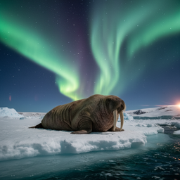 | Ultra photorealistic — 35mm film, natural grain, no AI look (default) |
| `cinematic` | 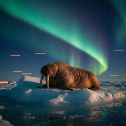 | Hollywood blockbuster — anamorphic, dramatic lighting, teal/orange |
| `ghibli` | 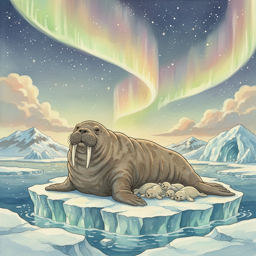 | Studio Ghibli — hand-painted, lush backgrounds, whimsical |
| `wes-anderson` | 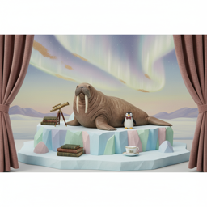 | Symmetrical, pastel palette, meticulous production design |
| `noir` |  | Film noir — high contrast B&W, dramatic shadows, 1940s |
| `cyberpunk` |  | Neon-lit dystopia — magenta/cyan, rain-slicked streets |
| `vintage-film` | 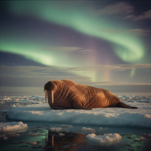 | 1970s analog — heavy grain, faded colors, Kodak film stock |
| `anime` | 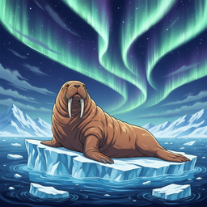 | Modern anime — sharp linework, vivid colors, dynamic angles |
| `watercolor` | 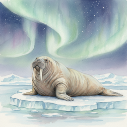 | Soft painted — visible brush strokes, flowing colors, dreamy |
| `documentary` | 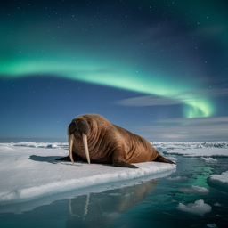 | Raw handheld — 16mm film, natural light, authentic |
| `kurzgesagt` |  | Flat design motion graphics — vibrant vector, rounded shapes, bold colors |
| `synthwave` |  | 80s retro-futuristic — neon grids, chrome, sunset gradients, laser lines |
| `comic-book` | 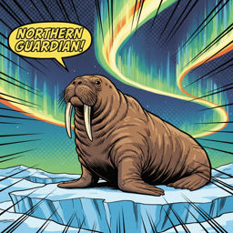 | Pop art — bold ink outlines, halftone dots, vivid primary colors |
| `pixel-art` | 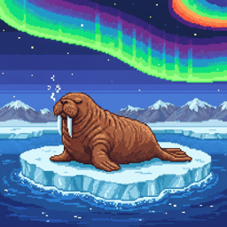 | Retro 16-bit gaming — chunky pixels, limited palette, nostalgic |
| `paper-cutout` | 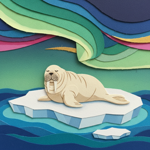 | Paper craft — layered cardstock, hand-cut edges, handmade charm |
| `low-poly` |  | Faceted 3D geometry — crystalline surfaces, vibrant gradients, minimal |
| `claymation` | 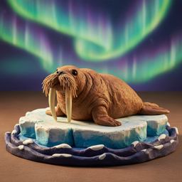 | Stop-motion clay — sculpted figures, fingerprint textures, warm lighting |
| `vaporwave` | 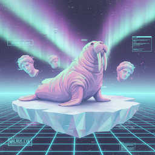 | 90s surreal digital — pastel gradients, glitch effects, marble busts |

## Output Structure

```
VideoReproductionPlan
├── title                    # in target language
├── description              # video concept and hook
├── metadata_tags[]          # bilingual hashtags
├── viral_structure_notes    # hook analysis, content arc
├── characters[]
│   ├── character_name
│   ├── character_description    # identical across all scenes
│   └── t2i_reference_prompt     # Nano Banana 2, plain background, multi-angle
├── scenes[]
│   ├── scene_number
│   ├── duration_seconds         # 8, 16, or 24 (multiples of 8)
│   ├── generation_method        # "t2i_i2v" (characters) or "t2v" (environment only)
│   ├── video_prompt             # Veo 3, first 8s
│   ├── video_extend_prompt      # continuation if >8s
│   ├── t2i_prompt               # Nano Banana 2 reference image
│   ├── voiceover_text           # target language, humanized
│   ├── voiceover_duration_estimate_seconds
│   └── scene_description
└── cover_t2i_prompt         # thumbnail image prompt
```

### Scene duration logic

- Veo 3 generates 8s max per clip
- 16s scene = 8s video looped 2x (ideal length)
- 24s scene = 8s video + extend prompt for continuation
- Ads, sponsors, and end cards are automatically filtered out

### Generation methods

- **t2i_i2v**: Any scene with characters → generate reference image first (Nano Banana 2), then animate (Veo 3). Ensures visual consistency.
- **t2v**: Pure environmental/atmospheric scenes only → direct text-to-video.

## Cost

Uses Gemini 2.5 Flash pricing. Token usage and USD cost are displayed after each run.

| | Per 1M tokens |
|---|---|
| Input (video + text) | $0.30 |
| Output | $2.50 |

Typical cost: **$0.05 – $0.15** per analysis depending on video length.

## Requirements

- Python 3.11+
- `ffmpeg` in PATH (for video merging)
- `GEMINI_API_KEY` environment variable

## License

MIT
